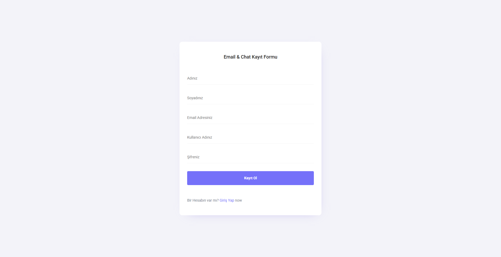
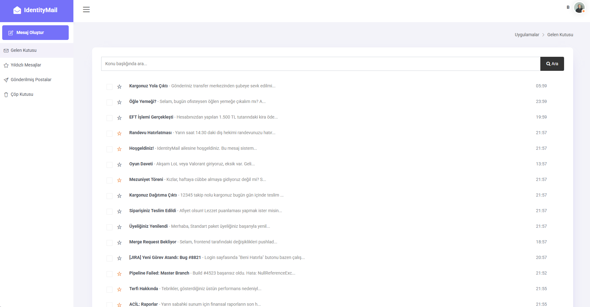
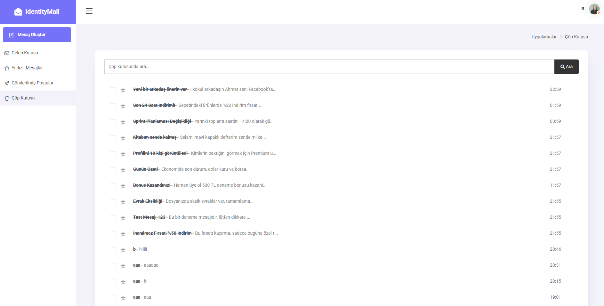
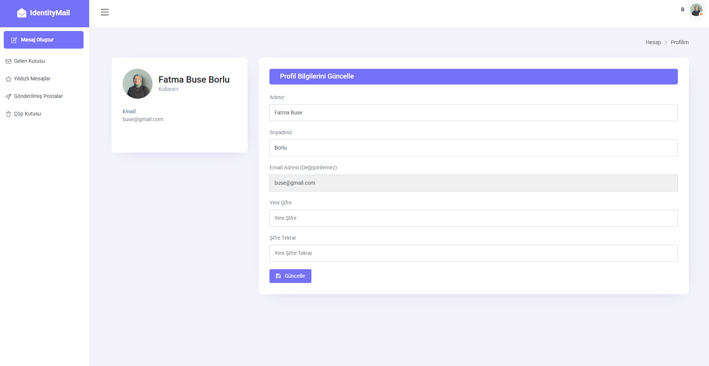
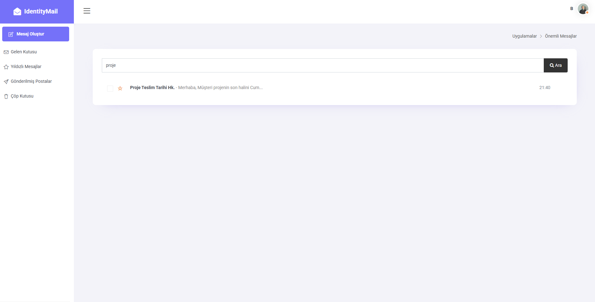

<h1 style="border-bottom: none;">📧 IdentityChatMail</h1>

## 🚀 Proje Hakkında

**IdentityMail**, ASP.NET Core altyapısı üzerine kurgulanmış, modern Quixlab admin teması ile giydirilmiş bir iç mesajlaşma (mail) simülasyonudur.

Proje, standart bir CRUD uygulamasının ötesine geçerek; **Soft Delete (Çöp Kutusu)**, **Favorilere Ekleme (Yıldızlama)**, **Akıllı Arama** ve **Profil Yönetimi** gibi gelişmiş özellikleri barındırır. Identity kütüphanesi ile güvenli bir kullanıcı altyapısı sunar.

---

## 🔥 Temel Özellikler

* **Modern UI/UX:** Quixlab teması projenin ihtiyaçlarına göre özel olarak revize edildi. Gereksiz menüler atıldı, kullanıcıyı yormayan sade ve odaklı bir yapı kuruldu.
* **Mesajlaşma Sistemi:**
    * **Gelen & Giden Kutusu:** Kullanıcılar sistemdeki diğer kullanıcılara mail gönderebilir ve gelenleri okuyabilir.
    * **Akıllı Cevapla (Reply):** Gelen mesaja "Cevapla" denildiğinde, alıcı adresi ve konu başlığı (Re: formatında) otomatik olarak doldurulur.
    * **Anlık Arama:** Konu başlıklarında büyük/küçük harf duyarlılığı olmadan anlık arama yapılabilir.
* **Soft Delete (Çöp Kutusu):** Silinen mesajlar veritabanından hemen uçmaz. Gerçek bir mail deneyimi için önce "Çöp Kutusu"na taşınır (`IsTrash`), istenirse oradan kalıcı olarak silinebilir.
* **Favoriler (Yıldızlama):** Önemli mesajlar tek tıkla yıldızlanarak ayrı bir sekmede filtrelenebilir.
* **Profil Yönetimi:**
    * Kullanıcılar Ad, Soyad ve Şifre bilgilerini güncelleyebilir.
* **Bildirimler:** Mesaj gönderimi veya silme işlemlerinde standart, sıkıcı tarayıcı uyarıları yerine modern **SweetAlert** popup'ları kullanıldı.

---

## 🛠️ Teknik Detaylar

* **Framework:** .NET 6.0 / .NET 8.0 (Core MVC)
* **Veritabanı:** MSSQL Server
* **ORM:** Entity Framework Core (Code First Yaklaşımı)
* **Authentication:** ASP.NET Core Identity
* **Frontend:** HTML5, CSS3, Bootstrap, jQuery

---

## 📸 Proje Görselleri

Uygulamanın tüm arayüz ve özelliklerinden kareler:

  <h3>🔐 Giriş ve Kayıt İşlemleri</h3>
  
Quixlab temasının sadeleştirilmiş, tam ekran login ve register arayüzü.

  
    
  

    
 

  <h3>📩 Mesajlaşma (Gelen & Giden Kutusu)</h3>
  
Kullanıcı dostu liste yapısı. İsimsiz, konu odaklı ve sadeleştirilmiş görünüm.

  
    
  

    
 

  <h3>📝 Mesaj Oluşturma & Okuma</h3>
  
Odaklanmış form yapısı ve detaylı mesaj okuma ekranı.

  
    
     
 

  <h3>⭐ Favoriler & 🗑️ Çöp Kutusu</h3>
  
Önemli mesajların filtrelenmesi ve silinen mesajların yönetimi.

  
    
  

    
 

  <h3>👤 Profil Yönetimi</h3>
  
Kullanıcıların kişisel bilgilerini ve fotoğraflarını güncelleyebildiği kart yapısı.

  

    
 

  <h3>✅ Bildirimler & Arama</h3>
  
SweetAlert ile modern bildirimler ve konu başlığına göre anlık arama.

  
    
  
    
  

