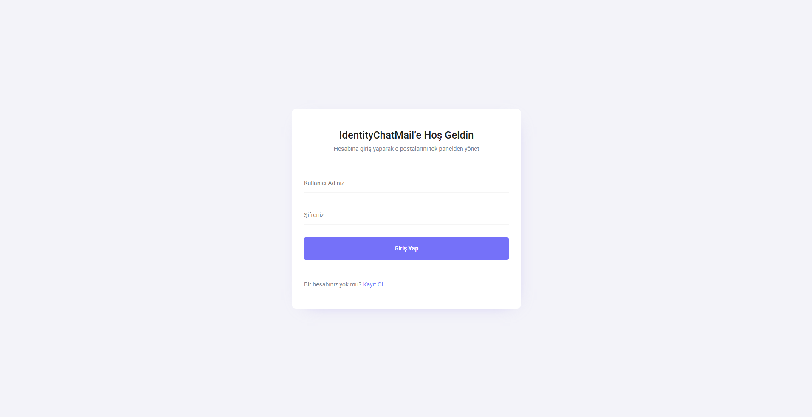
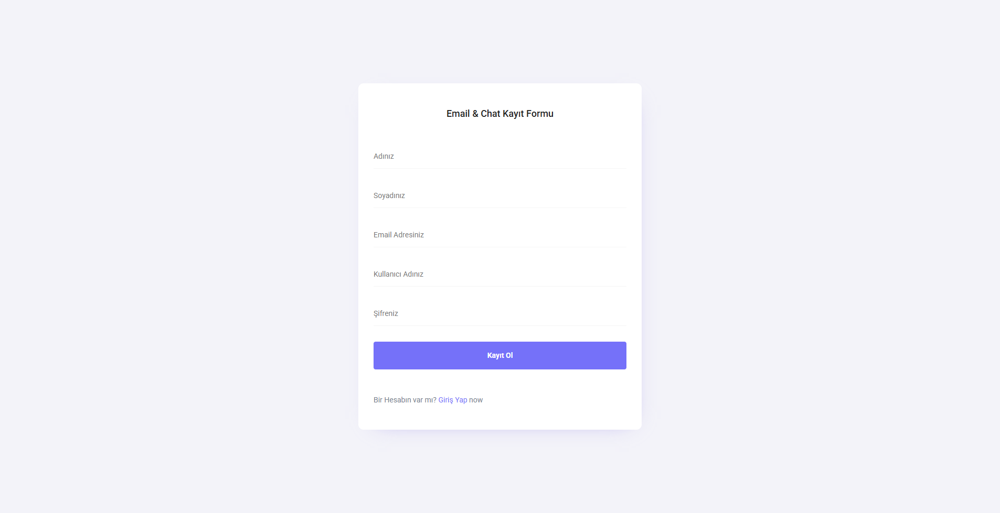
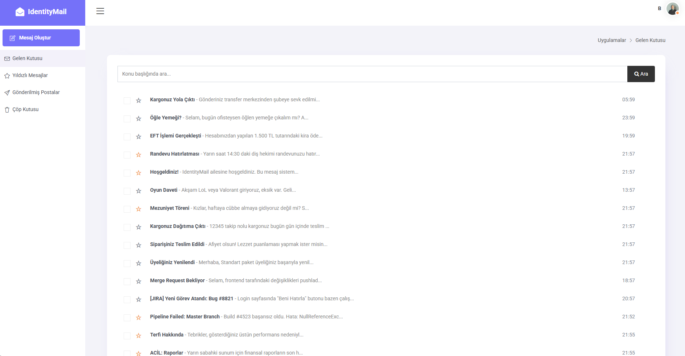
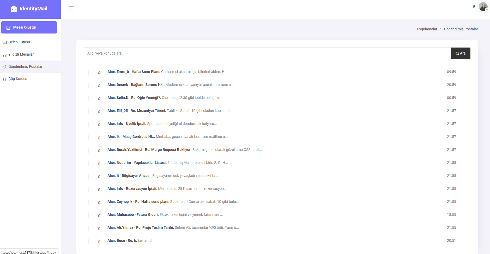
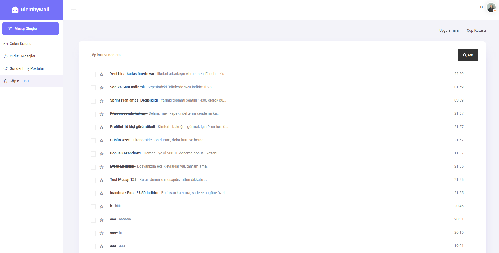
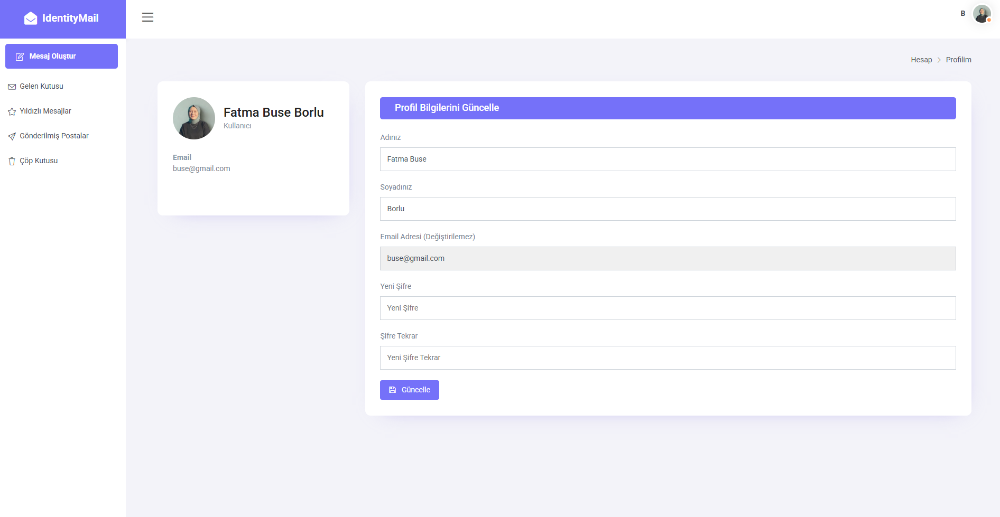
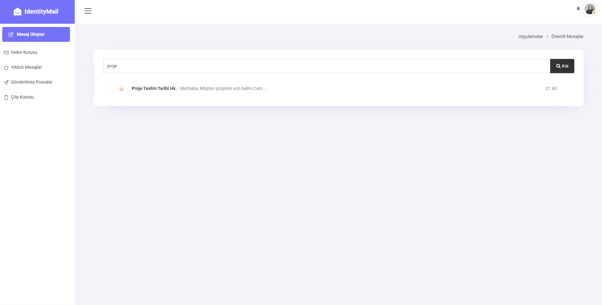

# IdentityChatMail

IdentityChatMail is an ASP.NET Core MVC application that simulates an internal mail and messaging system. It includes user registration/login with ASP.NET Core Identity, inbox and sent message flows, soft delete, favorites, profile management, search, and a customized Quixlab-based UI.

The project is useful as a portfolio example for learning and demonstrating ASP.NET Core MVC, Entity Framework Core Code First, SQL Server, Identity authentication, and CRUD-oriented web application development.

## Features

- User registration and login with ASP.NET Core Identity
- Inbox and sent message management
- Message detail view
- Reply flow with automatically filled recipient and subject
- Soft delete flow with trash folder
- Permanent delete from trash
- Favorite/starred messages
- Case-insensitive subject search
- User profile update screen
- SweetAlert-based user notifications
- Customized Quixlab admin theme integration

## Tech Stack

- ASP.NET Core MVC 8.0
- C#
- Entity Framework Core
- EF Core Code First Migrations
- ASP.NET Core Identity
- SQL Server
- Razor Views
- HTML5, CSS3, Bootstrap, jQuery
- SweetAlert
- Quixlab Admin Template

## Project Structure

```text
IdentityChatMail/
├── IdentityChatMail.sln
├── IdentityChatMail/
│   ├── Context/
│   │   └── MailContext.cs
│   ├── Controllers/
│   ├── Entities/
│   ├── Migrations/
│   ├── Models/
│   ├── Views/
│   ├── wwwroot/
│   ├── Program.cs
│   └── IdentityChatMail.csproj
├── Görseller/
└── README.md
```

## Requirements

Before running the project, make sure the following tools are installed:

- .NET 8 SDK
- SQL Server, SQL Server Express, or LocalDB
- Visual Studio 2022 or Visual Studio Code
- EF Core CLI tools

Install EF Core CLI tools if they are not already installed:

```bash
dotnet tool install --global dotnet-ef
```

If the tool is already installed, update it:

```bash
dotnet tool update --global dotnet-ef
```

## Database Setup

The project uses SQL Server with Entity Framework Core Code First migrations.

The current database configuration is defined in:

```text
IdentityChatMail/Context/MailContext.cs
```

Current connection string:

```csharp
Server=DESKTOP-NBRMDOS; initial Catalog=EmailChatDb;integrated Security=true;trust server certificate=true
```

Before running the project locally, update the `Server` value according to your SQL Server setup. Examples:

For SQL Server Express:

```csharp
Server=.\\SQLEXPRESS; initial Catalog=EmailChatDb;integrated Security=true;trust server certificate=true
```

For LocalDB:

```csharp
Server=(localdb)\\MSSQLLocalDB; initial Catalog=EmailChatDb;integrated Security=true;trust server certificate=true
```

After updating the connection string, apply migrations:

```bash
dotnet ef database update --project IdentityChatMail/IdentityChatMail.csproj --startup-project IdentityChatMail/IdentityChatMail.csproj
```

This command creates the `EmailChatDb` database and required Identity/message tables.

## How to Run

Clone the repository:

```bash
git clone https://github.com/FatmaBuseBorlu/IdentityChatMail.git
```

Navigate into the project folder:

```bash
cd IdentityChatMail
```

Restore dependencies:

```bash
dotnet restore
```

Apply database migrations:

```bash
dotnet ef database update --project IdentityChatMail/IdentityChatMail.csproj --startup-project IdentityChatMail/IdentityChatMail.csproj
```

Run the application:

```bash
dotnet run --project IdentityChatMail/IdentityChatMail.csproj
```

Open the application in your browser using the localhost URL shown in the terminal.

## Usage Flow

1. Register a new user.
2. Log in with the created account.
3. Create another user to test message sending between users.
4. Send messages between users.
5. Test inbox, sent box, reply, favorite, trash, search, and profile update flows.

## Screenshots

### Login and Register

<div align="center">
  
  <br><br>
  
</div>

### Inbox and Sent Box

<div align="center">
  
  <br><br>
  
</div>

### Create and Read Messages

<div align="center">
  
  <br><br>
  
</div>

### Favorites, Trash, Profile and Search

<div align="center">
  
  <br><br>
  
  <br><br>
  
  <br><br>
  
</div>

### Notifications

<div align="center">
  
  <br><br>
  
</div>

## What I Practiced

- ASP.NET Core MVC project structure
- User authentication with ASP.NET Core Identity
- Entity Framework Core Code First migrations
- SQL Server database integration
- CRUD operations with relational entities
- Soft delete behavior
- Search and filtering logic
- Profile update flow
- Razor View-based UI development
- Admin template customization

## Future Improvements

- Move the connection string from `MailContext.cs` to `appsettings.json`
- Add role-based authorization
- Add pagination for message lists
- Add unread/read message status
- Add email notification integration
- Add unit tests for message operations
- Add Docker support for easier local setup

## Repository

GitHub: https://github.com/FatmaBuseBorlu/IdentityChatMail